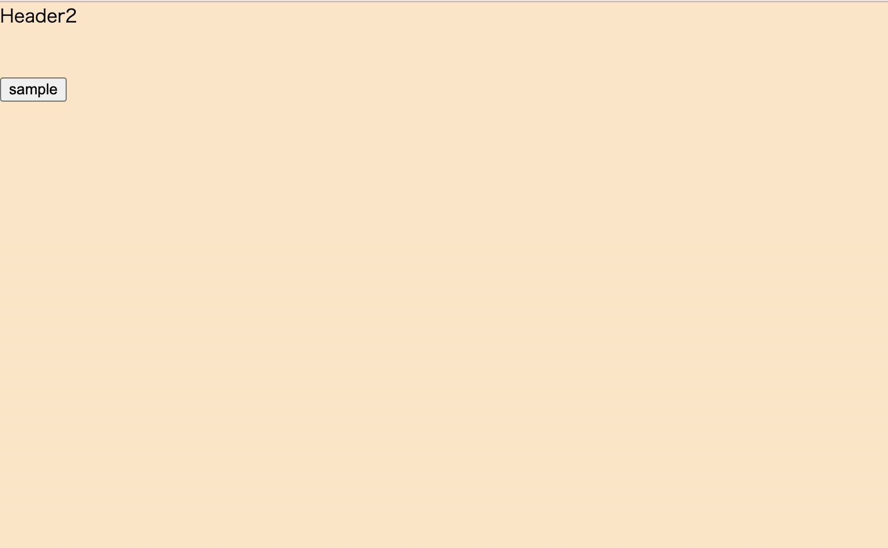
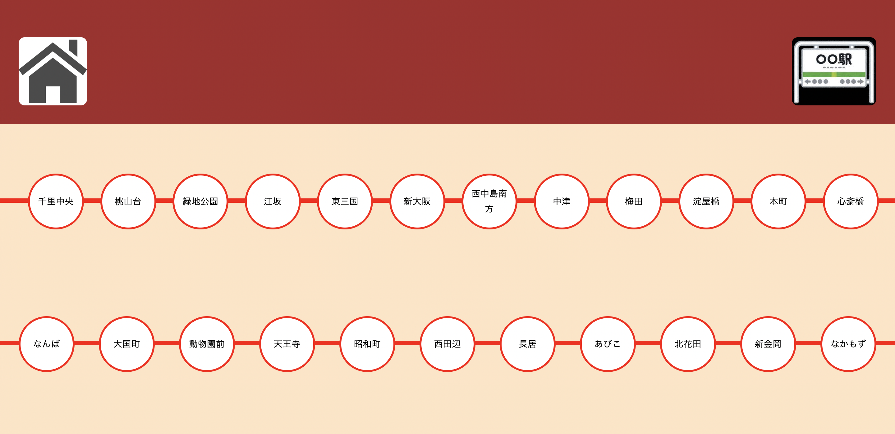

# Getting start in development

in the frontend directory,

```sh
docker build -t npm-advanced-software -f Dockerfile_debug .

docker run -it -p "3000:3000" npm-advanced-software
```

You open http://localhost:3000/ in you browser and then you will see the following screen.



or if you open http://localhost:3000/stations in you browser and then you will see the following screen.

